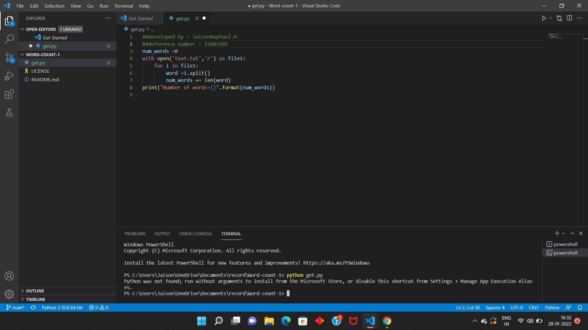

# Word-count
## AIM:
To write a python program for getting the word count from a text.
## EQUIPEMENT'S REQUIRED: 
PC
Anaconda - Python 3.7
## ALGORITHM: 
### Step 1:
To open the text file and made it to reading mode

### Step 2: 
 use for loop in program .

### Step 3: 
then calling the function name as "program"

### Step 4:  
then calling the function name as "program"

### Step 5: 
call count_words to execute the length of words and give an initial value as 0.

### Step 6: 
print count_words to check and Run the program without errors.

## PROGRAM:
~~~
#developed by : JaisonRaphael.V
#registered number:21001985

num_words =0
with open('text.txt','r') as file1:
    for i in file1:
        word =i.split()
        num_words += len(word)
print("Number of words={}".format(num_words))  
~~~

### OUTPUT:

## RESULT:
Thus the program is written to find the word count from a text.
